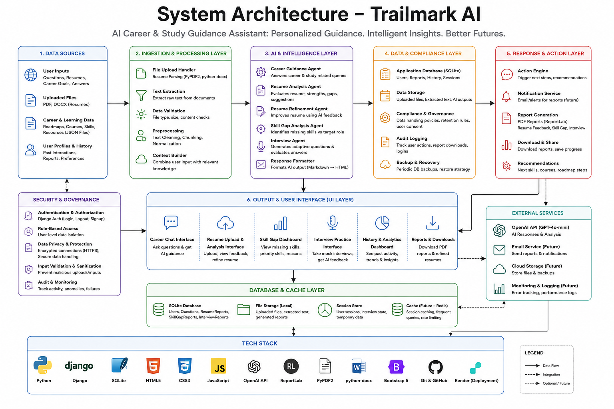
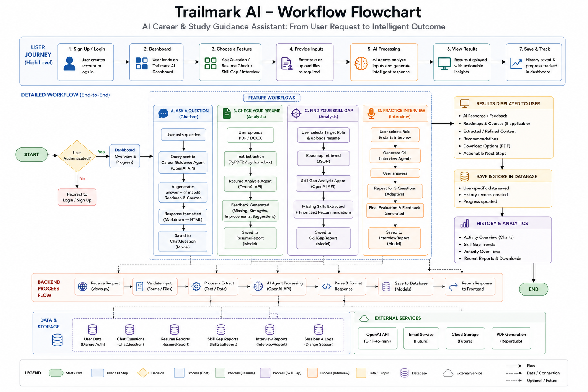
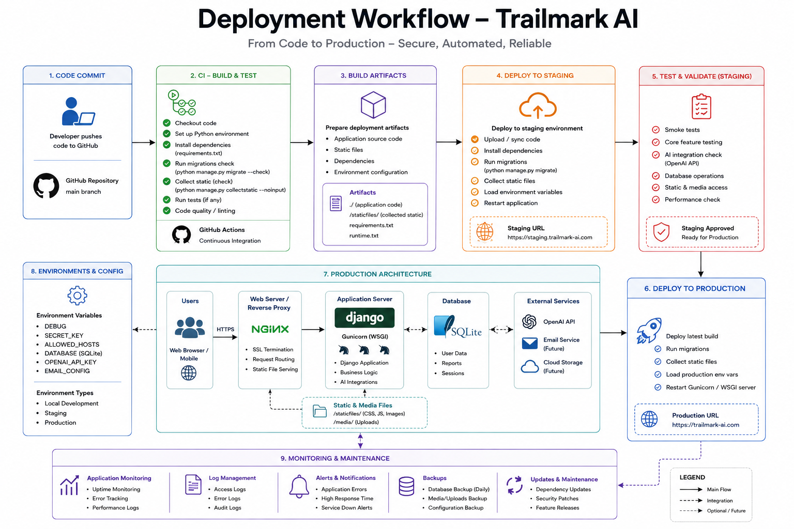

 
# Trailmark — AI Career & Study Guidance Assistant
 
An AI-powered platform that provides personalised career and study guidance in one place — built for **NextGen Innovation 2026** hackathon under the **AI for Social Impact** theme.
 
## Problem
 
Students today are often unsure about which skills to learn, how to prepare for interviews, or how to plan their career path. This information is scattered across many websites, making it overwhelming and time-consuming to piece together.
 
## Solution
 
An AI chatbot and guidance dashboard that brings career roadmaps, learning resources, resume feedback, resume refinement, skill-gap analysis, and mock interview practice into a single platform — styled with **Trailmark**, a trail/journey-themed design system.
 
The app opens on a **Dashboard** landing page ("Navigate Your Tech Career with Confidence") with four feature cards — AI Career Advisor, Resume Review, Skill Gap Analysis, and Mock Interviews — each with a "Get Started" button. A tab-based navigation bar (Dashboard · Advisor · Resume · Skill Gap · Mock Interview · History) lets you jump between every tool instantly, with your progress tracked by a circular progress ring on the Dashboard tab. **History** sits as its own page in the nav, with a full analytics dashboard.
 
## System Diagrams
 
### System Architecture
End-to-end view of the platform — data sources, the ingestion/processing layer, the AI & intelligence layer (five specialised agents built on OpenAI's GPT-4o-mini), the data & compliance layer, and the response/action layer, plus the UI layer and tech stack.
 

 
### Workflow Flowchart
The end-to-end user journey — from sign-up/login through the Dashboard, into each of the four feature workflows (Ask a Question, Check Your Resume, Find Your Skill Gap, Practice Interview), the shared backend processing flow, and how results are saved and surfaced on the History & Analytics page.
 

 
### Deployment Workflow
From code commit through CI build & test, staging deployment and validation, to production — including the production architecture (Nginx → Gunicorn/Django → SQLite), environment configuration, and ongoing monitoring & maintenance.
 

 
## Features
 
- **Dashboard Landing Page** — a hero introduction plus four feature cards (AI Career Advisor, Resume Review, Skill Gap Analysis, Mock Interviews), each linking straight into that tool.
- **Tab-Based Navigation** — Dashboard, Advisor, Resume, Skill Gap, and Mock Interview switch instantly with no page reload; History opens as its own page.
- **AI Career Chatbot** — ask any career or study-related question and get a detailed, AI-generated answer, rendered as clean formatted text (headings, bold, bullet points). If the question matches one of the supported roles, a step-by-step roadmap and curated courses are shown alongside the answer.
- **Career Roadmaps** — step-by-step, 8-step learning paths, currently covering 20 roles: AI Engineer, Data Scientist, Web Developer, Cloud Engineer, Cybersecurity Analyst, Data Analyst, UI/UX Designer, DevOps Engineer, Product Manager, Backend Developer, Frontend Developer, Mobile App Developer, QA/Test Automation Engineer, Blockchain Developer, Game Developer, Business Analyst, Database Administrator, Network/Systems Administrator, Digital Marketing Specialist, and Technical Writer.
- **Resource Recommendations** — curated, individually-verified courses linked to each career path.
- **Resume Analysis** — upload a resume (PDF or DOCX) and get AI-generated feedback on strengths, missing sections, and specific actionable suggestions.
- **In-App Resume Refinement** — edit the extracted resume text directly, then click "Refine with AI" to have the AI rewrite it using the feedback's suggestions. The AI is explicitly instructed never to invent new facts, employers, or achievements. The refined version stays editable and downloads as its own PDF.
- **Skill-Gap Analysis** — upload a resume and pick a target role to see which skills you already have, which are missing, and a prioritised list of 3–5 skills to learn next, each with a reason.
- **Interview Practice Mode** — pick a role, answer 5 AI-generated mock interview questions one at a time, and receive structured feedback (overall impression, strengths, areas to improve, one practical tip).
- **User Accounts** — sign up, log in, and every result above is saved to your account.
- **Branded PDF Export** — every report type (resume feedback, refined resume, skill-gap report, interview feedback) can be downloaded as a branded PDF on demand.
- **History / Analytics Dashboard** — a dedicated page showing:
  - a donut chart breaking down activity across Questions, Resumes, Skill Gaps, and Interviews (displayed side-by-side with the trend card)
  - a ranked "Skill Gap Trends" list (with a dot-scale) showing which skills come up as missing most often
  - a monthly "Activity Over Time" trend bar
  - time-stamped logs of every question, resume check, skill-gap report, and mock interview, each with its own PDF download button
- **Light & Dark Mode** — toggle in the top bar, persisted via localStorage across every page.
- **Session-Aware Waypoints** — each waypoint's result is cached in the session so moving between tabs in the same visit doesn't wipe earlier results, but a fresh login or reload after navigating away starts empty.
- **Graceful Error Handling** — every OpenAI call and file upload is wrapped so failures (empty input, an unreadable file, a dropped API call) show a friendly inline error banner instead of crashing the page.
- **Drag-and-Drop Resume Upload** — resume upload zones support drag-and-drop with filename confirmation, plus loading states and double-submit protection on every form.
- **Collapsible Answers & Page-Loading Bar** — long AI answers collapse behind a chevron toggle, and a top-loading progress bar shows while any form submits.
## Tech Stack
 
| Layer | Technology |
|---|---|
| Backend | Django |
| AI | OpenAI API (GPT-4o-mini), with a tailored system prompt per feature |
| Auth | Django's built-in authentication (session-based login/signup) |
| Frontend | Server-rendered Django templates — HTML, CSS, vanilla JS (Trailmark design system, embedded per-template); no separate frontend framework |
| Database | SQLite |
| Resume Parsing | PyPDF2 (PDF), python-docx (DOCX) |
| PDF Export | ReportLab — renders each AI report into a branded PDF on demand |
| Text Formatting | `markdown` (converts AI responses into styled HTML) |
| Production Server | Gunicorn (Render), WhiteNoise for static files |
| Fonts | Fraunces (headings), Inter (body), IBM Plex Mono (labels) via Google Fonts |
 
## Project Structure
 
```
AI-Career-Guidance-Assistant/
├── backend/
│   ├── config/                       # Django project settings, urls.py, asgi.py, wsgi.py
│   ├── chatbot/
│   │   ├── models.py                   # ChatQuestion, ResumeReport, SkillGapReport, InterviewReport
│   │   ├── views.py                    # One view per feature (REST-style endpoints) + shared render_home()
│   │   ├── admin.py, apps.py, tests.py
│   │   ├── migrations/
│   │   └── templates/chatbot/
│   │       ├── home.html                 # Dashboard + Advisor/Resume/Skill Gap/Interview tabs
│   │       ├── login.html
│   │       ├── signup.html
│   │       └── history.html              # Analytics dashboard + saved history
│   ├── venv/                         # local virtual environment (not committed)
│   ├── .env                          # OPENAI_API_KEY (not committed)
│   ├── db.sqlite3                    # local SQLite database
│   ├── requirements.txt
│   └── manage.py
├── frontend/                         # supplementary static assets
├── resources/
│   ├── roadmaps.json                 # 20 roles × 8-step roadmap
│   └── courses.json                  # verified course links per role
├── render.yaml                       # Render deployment config
├── docs/
│   └── diagrams/                     # system architecture, workflow, deployment diagrams
├── .gitignore
├── FUTURE_PLANS.md
└── README.md
```
 
## API / URL Structure
 
Each feature has its own endpoint rather than one large view handling everything:
 
| URL | Purpose |
|---|---|
| `/` | Home — Dashboard, Advisor, Resume, Skill Gap, Interview tabs |
| `/ask/` | Chatbot question → answer + roadmap + courses |
| `/resume/` | Resume upload → AI feedback |
| `/resume/refine/` | Refine the (edited) resume text with AI |
| `/resume/refine/pdf/` | Download the refined resume as PDF |
| `/skill-gap/` | Resume + target role → skill-gap report |
| `/interview/start/` | Begin a mock interview |
| `/interview/answer/` | Submit an answer / get next question or final feedback |
| `/history/` | Analytics dashboard + activity log |
| PDF download routes | One per report type — resume feedback, skill-gap report, interview feedback, refined resume |
| `/signup/`, `/login/`, `/logout/` | Auth |
 
## Setup Instructions
 
### Prerequisites
- Python 3.10+ (avoid 3.13 if using `pipreqs`, or use the trimmed requirements file)
- pip
### 1. Clone the repository
```bash
git clone https://github.com/yasmeenmh90-beep/AI-Career-Guidance-Assistant.git
cd AI-Career-Guidance-Assistant/backend
```
 
### 2. Create a virtual environment (recommended)
```bash
python -m venv venv
source venv/bin/activate   # macOS/Linux
venv\Scripts\activate      # Windows
```
 
### 3. Install dependencies
```bash
pip install -r requirements.txt
```
 
### 4. Set up environment variables
Create a `.env` file in the `backend/` folder:
```
OPENAI_API_KEY=your_openai_api_key_here
```
 
### 5. Add these lines to `config/settings.py`
```python
LOGIN_URL = 'login'
LOGIN_REDIRECT_URL = 'home'
LOGOUT_REDIRECT_URL = 'login'
```
 
### 6. Run migrations
```bash
python manage.py makemigrations   # only if a model has changed
python manage.py migrate
```
 
### 7. Start the development server
```bash
python manage.py runserver
```
 
The app will be available at `http://127.0.0.1:8000/`. You'll be redirected to the login page — sign up for a new account to get started.
 
### Everyday local run (once already set up)
```bash
cd AI-Career-Guidance-Assistant/backend
source venv/bin/activate
python manage.py migrate
python manage.py runserver
```
Stop the server with `Ctrl+C`.
 
### Shipping changes
```bash
git add .
git commit -m "your message here"
git push origin main
```
 
## How Resume Refinement Works
 
1. Upload a resume and get AI feedback (missing sections, strengths, suggestions)
2. Edit the extracted resume text directly in the text box if you like
3. Click **Refine with AI** — it rewrites the resume applying the feedback's suggestions, without inventing new facts, employers, or achievements
4. Keep editing the refined version as needed, then **Download as PDF**
## How Skill-Gap Analysis Works
 
1. Upload a resume and pick a target role
2. The AI compares the resume's content against that role's roadmap
3. It returns: skills already present, skills missing from the roadmap, and a prioritised list of 3–5 skills to learn next, each with a reason
4. A hidden, machine-readable `MISSING_SKILLS: ...` line is appended to the AI response, parsed out, and stored separately to power the "Skill Gap Trends" chart on the History page — it's never shown to the user directly
## How Interview Practice Mode Works
 
1. Select a role from the dropdown and click **Start Mock Interview**
2. The AI asks one question at a time (5 total), tracked via Django sessions
3. After the 5th answer, the AI generates structured feedback covering overall impression, strengths, areas to improve, and one practical tip
4. Click **Try Another Role** to restart with a different career path
## Adding More Career Paths
 
To add a new role, add matching entries to `resources/roadmaps.json` and `resources/courses.json` following the existing format — any new role automatically appears in the chatbot, skill-gap dropdown, and interview dropdown.
 
## Team
 
| Name | Role |
|---|---|
| Yasmeen Azmat Ali | Backend development (Django) — models, views, routing, session handling — and OpenAI API integration across all five AI-driven features (chatbot, resume feedback, resume refinement, skill-gap analysis, interview practice) |
| Mohammed Ayaan | Frontend UI/UX design, resource collection |
| Gagan | Project media section — deployment workflow diagram, system architecture diagram, demo video, presentation |
| Sai Krishna | Deployment |
 
## Hackathon
 
Built for **NextGen Innovation 2026** — Innovate • Collaborate • Transform
 
## Live Demo
 
- **PythonAnywhere:** https://yasmeenmh.pythonanywhere.com (that UI\UX Design is mine)
- **Render:** https://ai-career-guidance-assistant.onrender.com
## What's Next
 
- Tracking multiple resume versions over time, with a skill-gap-closing comparison across versions
- A DOCX export option for the refined resume (currently PDF-only)
- Richer analytics: trends over time, not just cumulative totals
- Expanded interview practice: role-specific question banks and voice-based practice
- Lightweight mentor/recruiter sharing via a read-only link to a roadmap or resume feedback report
 
